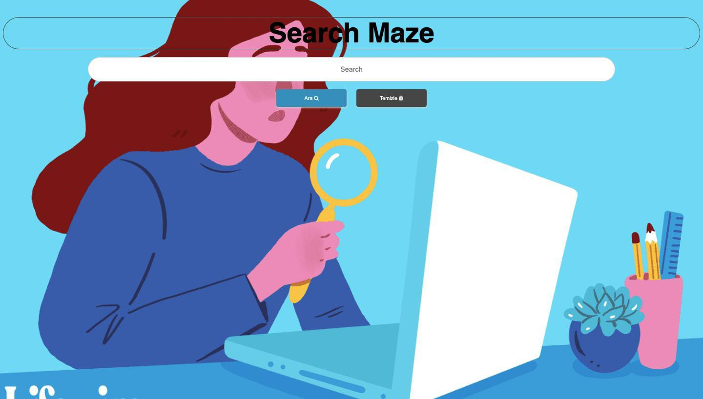

# Search Maze

> HTML, CSS, JavaScript Unsplash API 

> Canlı Proje [_here_](search-maze.vercel.app).

## İçerik
* [Genel Bilgi](#general-information)
* [Kullanılan Teknolojiler](#technologies-used)
* [Features](#features)
* [Projeye Bakış](#screenshots)
* [Kullanım](#usage)
* [Proje Durumu](#project-status)
* [Geliştirme İçin](#room-for-improvement)
* [Bilgilendirme](#acknowledgements)
* [İletişim](#contact)

## Genel Bilgi
- Unsplash API kullanarak basit bir JavaScript projesi yaptım.
- Bu proje sayesinde kelime girdiğinizde kelimeyle alakalı olan resim direkt karşınıza geliyor.

## Kullanılan Teknolojiler
- HTML
- CSS
- JavaScript
- Unsplash API

## Features
- Klavye hatası düzeltilecek

## Projeye Bakış

## Kullanım
Projeyi klonladıktan sonra Live Server eklentisi sayesinde kurabilir ve localinizde çalıştırabilirsiniz.

## Proje Durumu
Proje bitti.

## Geliştirme İçin
Geliştirme için tavsiye edilen öneriler alınacaktır.

## Bilgilendirme
- Bu proje basit bir resim arama projesi olacaktı fakat arayüzü özelleştirerek projeyi daha özgün kılmaya çalıştım.

## İletişim
[Twitter - @busenurcetin16](https://twitter.com/busenurcetin16) tarafından oluşturuldu, dilediğiniz zaman iletişime geçebilirsiniz.

## License 
Bu proje GNU General Public lisansı altında açık kaynak olarak paylaşılmıştır.

